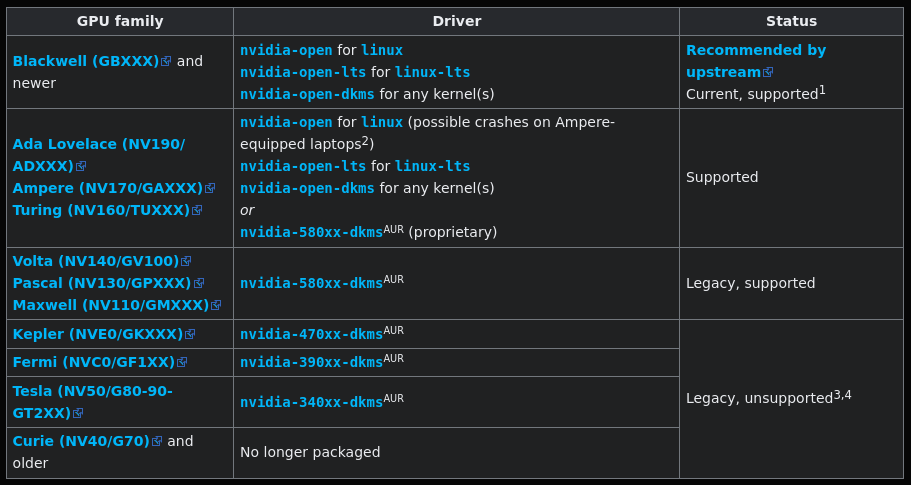

# Installation du driver GPU (NVidia) ([retour](../GAMING.md))

L'une des premières choses que l'on fait, même sous Windows, lors de l'acquisition d'un nouvel ordinateur, est l'installation des drivers, notamment ceux de la carte graphique.

Mais contrairement à Windows, nous n'installerons pas l'application NVIDIA App, permettant directement de détecter le GPU et d'installer les drivers adéquats, nous devrons installer manuellement le nécessaire.

## Les différents types de drivers

Tout d'abord, il faut savoir que, sous Linux, nous avons principalement deux types de pilotes : le pilote propriétaire et le pilote "open" (Nouveau).

La principale différence entre les deux est que l'un est plus stable, permettant de profiter pleinement des performances du GPU, tandis que l'autre est plus récent.

Pour savoir lequel installer, il faut se renseigner sur la famille de votre GPU en récupérant le codename via la commande :
```
lspci -k -d ::03xx
```

Puis, en cherchant la famille de votre GPU sur ce site, via le codename précédemment récupéré :

https://nouveau.freedesktop.org/CodeNames.html

Une fois le nom de la famille de votre GPU récupéré, vous pourrez comparer avec le tableau disponible dans la [documentation d'Arch](https://wiki.archlinux.org/title/NVIDIA).



En règle générale, les anciennes cartes graphiques (GT, GTX (hors 1650 et ses dérivés), ...) utiliseront le driver propriétaire. Pour les plus récentes, il vaut mieux utiliser le driver "open" (surtout pour la dernière génération).

Si vous devez utiliser le driver "open", il faut aussi déterminer la version à installer en fonction de votre noyau :
- nvidia-open (le noyau de base),
- nvidia-open-lts (noyau lts),
- nvidia-open-dkms (les autres noyaux : hardened, zen, ...).

## Procédure d'installation du driver (OpenGL/Vulkan (32/64 Bits))

Tout d'abord, assurez-vous que le multilib (permettant d'installer des paquets 32 bits) est configuré et actif pour pacman. Sinon, veuillez suivre la configuration décrite dans [SOFTWARE#Cours](../../software/md/cours.md).

### Installation du driver :

```
sudo pacman -S power-profiles-daemon dkms nvidia-open-dkms nvidia-utils lib32-nvidia-utils nvidia-settings vulkan-icd-loader lib32-vulkan-icd-loader vulkan-tools
```

### Configuration de /etc/mkinitcpio.conf :

Modification du contenu :
```
MODULES=(nvidia nvidia_modeset nvidia_uvm nvidia_drm)
...
HOOKS=(... kms ...)
```

Puis, re génération des images initramfs :
```
sudo mkinitcpio -P
```

### Modifications des entrées du bootloader :

```
# Ajout des paramètres :
nvidia.NVreg_OpenRmEnable=1 
nvidia_drm.modeset=1 
nvidia_drm.fbdev=1 
nvidia.NVreg_EnableGpuFirmware=0 
nvidia.NVreg_PreserveVideoMemoryAllocations=1
```

### Configuration de /etc/pacman.d/hooks/nvidia.hook :

```
[Trigger]
Operation=Install
Operation=Upgrade
Operation=Remove
Type=Package
Target=nvidia-open-dkms
Target=linux-zen

[Action]
Description=Updating NVIDIA module in initcpio
Depends=mkinitcpio
When=PostTransaction
NeedsTargets
Exec=/bin/sh -c 'while read -r trg; do case "$trg" in linux-zen) exit 0; esac; done; /usr/bin/mkinitcpio -P'
```

> [!NOTE]
> Si le répertoire /etc/pacman.d/hooks n'existe pas, il faut le créer.