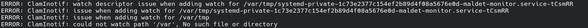

# Installation d'Antivirus ([retour](../SECURITY.md))

Bien que les antivirus sur Linux ne soit pas aussi développé que ceux sur Windows, il n'en reste pas moins intéressant d'avoir une solution antivirus d'installée.

La particularité sur Linux, est que le plus gros risque de sécurité est la présence de rootkits.

## Installation de rkHunter :

Il s'agit d'une solution permettant de détecter la présence de rootkits sur votre système.

> [!IMPORTANT]
> rkhunter ne supprime pas les rootkits, il les détecte uniquement.

### Installation de rkhunter et mise à jour des propriétés/configurations :
```
sudo pacman -S rkhunter
sudo rkhunter --propupd
sudo rkhunter --update
sudo rkhunter --propupd
```

### Lancer une analyse avec rkhunter :
```
sudo rkhunter --check --sk
sudo rkhunter --config-check
```

## Installation de ClamAV :

ClamAV est l'une des solutions antivirus les plus complètes, qui se basent sur la signature des virus pour les détecter sur votre système.

### Téléchargement de ClamAV :
```
sudo pacman -S clamav
```

### Configuration de /etc/clamav/clamd.conf :
```
# Il faut modifier les lignes suivantes :
LogTime yes
ExtendedDetectionInfo yes
User clamav
MaxDirectoryRecursion 20
DetectPUA yes
HeuristicAlerts yes
ScanPE yes
ScanELF yes
ScanOLE2 yes
ScanPDF yes
ScanSWF yes
ScanXMLDOCS yes
ScanHWP3 yes
ScanOneNote yes
ScanMail yes
ScanHTML yes
ScanArchive yes
Bytecode yes
AlertBrokenExecutables yes
AlertBrokenMedia yes
AlertEncrypted yes
AlertEncryptedArchive yes
AlertEncryptedDoc yes
AlertOLE2Macros yes
AlertPartitionIntersection yes
OnAccessExcludeUname clamav
# OnAccessMountPath /
OnAccessIncludePath /home
OnAccessIncludePath /tmp
OnAccessIncludePath /var
OnAccessIncludePath /opt
OnAccessIncludePath /usr
OnAccessExtraScanning=yes
OnAccessPrevention=no
# OnAccessExcludeRootUID yes
VirusEvent /etc/clamav/virus-event.bash
TemporaryDirectory /var/tmp/clamav-tmp
```


### Création du répertoire temporaire de ClamAV :
```
sudo mkdir -p /var/tmp/clamav-tmp
sudo chown clamav:clamav /var/tmp/clamav-tmp
sudo chmod 700 /var/tmp/clamav-tmp
```

### Configuration de répertoires à exclure :

Lors de l'utilisation de ClamAV, vous serez souvent amené à ajouter des répertoire à ne pas analyser, afin d'éviter les faux positifs.

Pour l'analyse avec clamdscan, vous pouvez utiliser l'instruction : ```ExcludePath ``` dans le fichier : ```/etc/clamav/clamd.conf``` pour exclure des répertoires de l'analyse.

Par exemple :
```
ExcludePath ^/proc/
ExcludePath ^/sys/
ExcludePath ^/usr/local/maldetect/
ExcludePath ^/var/lib/clamav/
ExcludePath ^/home/<username>/.vscode/
ExcludePath ^/root/quarantine/
ExcludePath ^/home/<username>/.config/Code/
ExcludePath ^/usr/lib/libreoffice/
ExcludePath ^/home/<username>/soft-local/Postman/
ExcludePath ^/home/<username>/.nvm/versions/node/
ExcludePath ^/usr/lib/modules/6.19.10-hardened1-1-hardened/build/
ExcludePath ^/home/<username>/.config/libreoffice/
ExcludePath ^/home/<username>/.var/app/org.mozilla.firefox/cache/
```

Pour l'analyse en temps réel (clamonacc), en théorie, vous devriez utiliser : ```OnAccessExcludePath ``` dans : ```/etc/clamav/clamd.conf```, sauf que pour une raison qui m'est inconnue, cette instruction n'est soit pas prise en compte, soit seulement certains sous-répertoire, soit est complétement prise en compte.

Afin d'éviter ce genre de problèmes, il peut être judicieux de créer un fichier : ```exclude-list.txt``` contenant les répertoires que l'on souhaite exclure.

Par exemple :
```
/usr/local/maldetect
/var/lib/clamav
/home/<username>/.vscode
/root/quarantine
/home/<username>/.config/Code
/usr/lib/libreoffice
/home/<username>/soft-local/Postman
/home/<username>/.nvm/versions/node
/usr/lib/modules/6.19.10-hardened1-1-hardened/build
/home/<username>/.config/libreoffice
/home/<username>/.var/app/org.mozilla.firefox/cache
```
> [!TIP]
> Pour voir les répertoires exclus avec clamonacc, il suffit de regarder les logs du service.

Ainsi que de modifier le processus gérant l'analyse en temps réel : ```/usr/lib/systemd/system/clamav-clamonacc.service``` de la manière suivante :
```
[Unit]
...
After=... local-fs.target systemd-tmpfiles-setup.service systemd-tmpfiles-setup-dev.service sddm.service
Wants=systemd-tmpfiles-setup.service 

[Service]
...
LimitNOFILE=524288
ExecStartPre=/usr/bin/sleep 20
Restart=on-failure
RestartSec=10
...
# Modifier la ligne ExecStart, faisant appel à la commande clamonacc, 
# en ajoutant la ligne suivante, juste après --log=... mais avant --move=...
--exclude-list=/chemin/vers/exclude-list.txt
```

> [!CAUTION]
> Il faut redémarrer les services : ```clamav-clamonacc``` et ```clamav-daemon```, ainsi que le système, afin que les modifications s'appliquent.

### Configuration de /etc/sudoers.d/clamav :
```
clamav ALL = (ALL) NOPASSWD: SETENV: /usr/bin/notify-send
```

### Configuration de /etc/clamav/virus-event.bash :

Script à écrire :
```
#!/bin/bash
PATH=/usr/bin
ALERT="Signature detected by clamav: $CLAM_VIRUSEVENT_VIRUSNAME in $CLAM_VIRUSEVENT_FILENAME"

# Send an alert to all graphical users.
for ADDRESS in /run/user/*; do
	USERID=${ADDRESS#/run/user/}
	/usr/bin/sudo -u "#$USERID" DBUS_SESSION_BUS_ADDRESS="unix:path=$ADDRESS/bus" PATH=${PATH} \
	/usr/bin/notify-send -u critical -i dialog-warning "Virus found!" "$ALERT"
done
```

> [!IMPORTANT]
> Pour fonctionner correctement, il faut s'assurer d'avoir la bibliothèque : ```libnotify``` d'installée.

Puis il faut rendre ce script exécutable :
```
sudo chmod +x /etc/clamav/virus-event.bash
```

### Configuration de /usr/lib/systemd/system/clamav-clamonacc.service :
```
# ajouter à la deuxième ligne ExecStart, avant --log=... : 
--fdpass
```

### Création du répertoire pour la mise en quarantaine :
```
sudo mkdir -p /root/quarantine
```

### Modification des fichiers /etc/clamav/freshclam.conf et /etc/clamav/clamd.conf pour décommenter les lignes :
```
DatabaseDirectory /var/lib/clamav
```

### Mise à jour de la base de données des signatures de virus :
```
sudo freshclam
```

### Activation du service clamav-daemon :
```
sudo systemctl enable clamav-daemon.service
sudo systemctl start clamav-daemon.service
```

### Activation du service clamav-clamonacc :
```
sudo systemctl enable clamav-clamonacc.service
sudo systemctl start clamav-clamonacc.service
```

### Création du fichier de log et changement du propriétaire en "clamav" :
```
sudo touch /var/log/clamav/freshclam.log
sudo chmod 600 /var/log/clamav/freshclam.log
sudo chown clamav /var/log/clamav/freshclam.log
```

### Activation du service permettant de mettre à jour la base de données des signatures une fois par jour :
```
sudo systemctl enable clamav-freshclam-once.timer
sudo systemctl start clamav-freshclam-once.timer
```

### Lancer une analyse avec ClamAV :
```
sudo clamdscan --multiscan --fdpass <chemin>
```

### Eviter les problèmes d'ajout des watchers sur les répertoires :

Dans certains cas, surtout au démarrage, il se peut que vous ayez des erreurs de ce type dans les logs de clamav-clamonacc :



Le principe est de faire en sorte de redémarrer le service une première fois au redémarrage, après un certain temps, et toutes les fois où ces erreurs seront relevées dans les logs.

Création de /etc/systemd/system/clamav-clamonacc-delayed-restart.service :

```
[Unit]
Description=One-shot delayed restart of ClamAV On-Access Scanner after boot

[Service]
Type=oneshot
ExecStart=/usr/bin/systemctl try-restart clamav-clamonacc.service
```

Création de /etc/systemd/system/clamav-clamonacc-delayed-restart.timer :

```
[Unit]
Description=Run a one-time delayed restart of ClamAV On-Access Scanner after boot

[Timer]
OnBootSec=45s
Unit=clamav-clamonacc-delayed-restart.service
Persistent=false

[Install]
WantedBy=timers.target
```

Création de /etc/systemd/system/clamav-restart-on-error.service :
```
[Unit]
Description=Redémarrage du service clamav-clamonacc lors d'erreurs d'ajout de chemins.
After=clamav-clamonacc.service

[Service]
Type=simple
ExecStart=/home/<username>/Documents/scripts/clamav-restartonerr.sh
Restart=on-failure

[Install]
WantedBy=multi-user.target
```

Création du script clamav-restartonerr.sh :
```
#!/bin/bash

while [[ true ]]
do
    ERROR=$(journalctl -u clamav-clamonacc --no-pager -n 5 | grep -E 'watch descriptor issue|issue when adding watch|could not watch path|could not add element to hash table|Communication error')

    if [[ ! $ERROR = '' ]]
    then
        echo Une erreur a été détécté, redémarrage du service clamav-clamonacc en cours...
        sudo systemctl restart clamav-clamonacc.service
        sleep 8
    else
        sleep 1
    fi
done
```

Changement des droits du script :
```
chmod +x /chemin/vers/clamav-restartonerr.sh 
```

Activation et démarrage des différents services/timers :
```
sudo systemctl daemon-reload

sudo systemctl enable clamav-clamonacc-delayed-restart.timer
sudo systemctl start clamav-clamonacc-delayed-restart.timer

sudo systemctl enable clamav-restart-on-error.service 
sudo systemctl start clamav-restart-on-error.service 
```

## Installation de Linux Malware Detect (LMD) :

Il s'agit d'une solution antivirus, permettant à la fois de réaliser des analyses pas signature et hirastique, en plus de certaines analyses avancées.

L'avantage de cette solution et que si ClamAV est installé, alors LMD l'utilisera pour une partie de ses analyses.

> [!CAUTION]
> Avant d'installer LMD, veuillez arrêter les services concernant ClamAV (clamav-daemon.socket, clamav-daemon.service, clamav-clamonacc.service et clamav-freshclam-once.timer) et les réactiver une fois l'installation terminée.

### Installation des prérequis :
```
sudo pacman -S inetutils ed inotify-tools which
```

### Téléchagement de l'archive :
```
wget https://www.rfxn.com/downloads/maldetect-current.tar.gz
```

### Extraction de l'archive :
```
tar -xvf maldetect-current.tar.gz
```

### Installation de LMD :
```
sudo ./install.sh
```

### Configuration de /usr/local/maldetect/conf.maldet :
```
# Modifier les lignes :
scan_clamscan="1"
quarantine_hits="1"
quarantine_clean="1"
scan_ignore_root="0"
scan_max_depth="50"
scan_max_filesize="500M"
inotify_monitor="1"
inotify_paths="/home,/var,/tmp"
```

### Configuration de /etc/systemd/system/maldet-monitor.service :
Il s'agit du service qui gérera l'analyse en temps réel de LMD, en sachant que celui-ci utilise inotify.

```
[Unit]
Description=Maldet Real-Time Monitor (inotify)
After=network.target

[Service]
Type=simple
ExecStart=/usr/local/maldetect/maldet --monitor /home,/var,/tmp
Restart=always
RestartSec=5
Nice=10
IOSchedulingClass=best-effort
IOSchedulingPriority=7
NoNewPrivileges=true
PrivateTmp=true

[Install]
WantedBy=multi-user.target
```

### Rechargement et activation de maldet-monitor.service :
```
sudo systemctl daemon-reexec
sudo systemctl daemon-reload
sudo systemctl enable maldet-monitor
sudo systemctl start maldet-monitor
```

### Activation de maldet.service :
```
sudo systemctl enable maldet.service
sudo systemctl start maldet.service
```

### Mise à jour de la base de données des signatures :
```
sudo maldet -u
```

> [!IMPORTANT]
> Il se peut qu'en tentant de démarrer les services ```maldet-monitor``` et ```maldet```, vous ayez une erreur dans les logs, concernant un fichier .pid manquant. Il suffit alors de redémarrer les deux services dans le même ordre (à savoir que vous pouvez être amené à les redémarrer plusieurs fois).

### Faire en sorte que ClamAV et LMD n'analysent pas dans leurs propres fichiers :

Afin d'éviter qu'ils suppriment leurs propres fichiers (notamment ceux contenants les signatures des virus) et donc ne supprime des fichiers empêchant leur fonctionnement, il suffit d'ajouter dans le fichier "/usr/local/maldetect/ignore_paths" :
```
/usr/local/maldetect
/var/lib/clamav
/etc/clamav
/run/clamav
/var/log/clamav
/usr/lib/libreoffice
/home/.config/Code
/root/quarantine
/home/<username>/.vscode
/home/<username>/.nvm/versions/node
/usr/lib/modules/6.19.10-hardened1-1-hardened/build
/home/<username>/.config/libreoffice
/home/<username>/.var/app/org.mozilla.firefox/cache
```

### Lancer une analyse avec LMD + ClamAV :
```
sudo maldet -a <chemin>
```

## Installation de CRON :

Maintenant que nos solutions antivirus sont installées, nous allons exécuter des analyses de manière régulière (une fois par semaine). Pour cela, nous réaliserons un petit script, qui sera exécuté par cron.

### Téléchargement de cronie :
```
sudo pacman -S cronie
```

### Activation du service :
```
sudo systemctl enable cronie.service
sudo systemctl start cronie.service
```

### Ajout d'une règle dans le crontab :
```
crontab -e

# Format d'une ligne :
<minute> <heure> <jour_du_mois> <mois> <jour_de_la_semaine> <commande>

# Valeur possible :
<minute> : 0 à 59.
<heure> : 0 à 23.
<jour_du_mois> : 1 à 31.
<mois> : 1 à 12.
<jour_de_la_semaine> : 0 à 6 (0 équivaut à dimanche).

# wildcard :
* : permet de spécifier tous les intervales de temps possibles.
, : permet de spécifier une liste de valeur.
- : permet de spécifier un intervale.
/ : permet de spécifier une période/fréquence.

# Exemple (Exécuter un script tous les dimmanches, à 18h30) :
30 18 * * 6 <commande>
```

### Script "av-scan.sh" :

Ce petit script permet de lancer une analyse rkhunter et lmd + clamav, puis d'écrire leur résultat dans des fichiers de logs :
```
#!/bin/bash

export DISPLAY=:0
export DBUS_SESSION_BUS_ADDRESS="unix:path=/run/user/$(id -u)/bus"

DATE=$(date +'%Y-%m-%d-%H-%M-%S')
DIR=~/logs/av-scan
RKH=rkhunter-scan.log
RKHC=rkhunter-complete.log
LMD=lmd-scan.log

if [ ! -d $DIR  ]; then
	mkdir -p $DIR
fi

notify-send -a AV-SCAN "Analyse en cours... Veuillez ne pas éteindre votre système !"

mkdir $DIR/$DATE

echo "___ Analyse du : $DATE ___" | tee $DIR/$DATE/$RKH

sudo rkhunter --check --sk | tee -a $DIR/$DATE/$RKH
sudo rkhunter --check-config | tee -a $DIR/$DATE/$RKH

echo "___ Analyse du : $DATE ___" | tee $DIR/$DATE/$RKHC
sudo cat /var/log/rkhunter.log | tee -a $DIR/$DATE/$RKHC

echo "___ Analyse du : $DATE ___" | tee $DIR/$DATE/$LMD
sudo maldet -a / | tee -a $DIR/$DATE/$LMD

notify-send -a AV-SCAN "Analyse terminé, résultats dans : \"$DIR/$DATE\"."
```

> [!TIP]
> Pour utiliser ce script comme une commande, lorsque vous voulez manuellement lancer un scan, il suffit d'ajouter dans PATH le chemin du répertoire où se trouve le script dans le fichier et un alias dans ```~/.bashrc```.