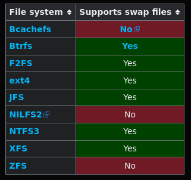

# Chiffrement d'un disque (LUKS/Secure Boot/TPM2) ([retour](../SECURITY.md))

Pour chiffrer la partition contenant le système et vos données, nous utiliserons le format LUKS et TMP2 pour contenir la clé pour l'ouvrir, afin de ne pas avoir le mot de passe à saisir à chaque redémarrage.

> [!IMPORTANT]
> Il est important de noter que pour pouvoir chiffrer le disque, il faut le réaliser au moment de l'installation d'Arch. En effet, il est impossible de le réaliser avec un système déjà installé, car le chiffrement entraînera l'effacement du disque.
>
> De plus, chaque partie de cette section est nommé avec leurs équivalents dans [INSTALL](../../install/INSTALL.md), afin que vous puissiez suivre au fur et à mesure les étapes pour pouvoir les réaliser.

## Partitionnement :

Comme dans [INSTALL#partitionnement](../../install/md/partitionnement.md), nous utiliserons l'outil cfdisk pour partitionner le disque.

```
cfdisk /dev/<nom disque (sans le numéro de partition)>
```

On vient créer 2 partitions :

\- La première : correspond à la partition où sera installé le bootloader (1G).

\- La deuxième : correspond à la partition racine du système.

En réalité, vous avez aussi la possibilité de créer une partition swap, comme dans [INSTALL#partitionnement](../../install/md/partitionnement.md), le problème est que, si vous suivez la même procédure que dans ce dernier, votre partition swap ne sera pas chiffrée, ce qui peut présenter un risque de fuite de la mémoire RAM.

Dès lors, vous pouvez chiffrer la partition swap de la même manière que la partition racine, en remplaçant mkfs et mount par mkswap et swapon. Il faudra aussi activer le TPM pour cette partition ([documentation d'Arch](https://wiki.archlinux.org/title/Dm-crypt/Swap_encryption#Using_a_swap_partition)).

Une alternative à l'utilisation d'une partition séparée est l'utilisation de swapfiles. Le principe reste le même : avoir un espace de stockage pour le swap de la RAM, mais, au lieu de dépendre d'une partition, tout va dépendre des blocs alloués au swapfile sur le système de fichiers.

D'après [la documentation d'Arch](https://wiki.archlinux.org/title/Partitioning#Swap:~:text=A%20swap%20is%20a%20file%20or%20partition%20that%20provides%20disk%20space%20used%20as%20virtual%20memory%2E%20Swap%20files%20and%20swap%20partitions%20are%20equally%20performant%2C%20but%20swap%20files%20are%20much%20easier%20to%20resize%20as%20needed%2E), nous sommes quasiment à l'identique en termes de performances, en plus d'être plus facile à redimensionner au besoin qu'une partition.

De plus, [la documentation d'Arch](https://wiki.archlinux.org/title/Power_management/Suspend_and_hibernate#Configure_the_initramfs) explique comment activer l'hibernation, même avec un swapfile. Dans mon cas, l'hibernation n'est pas une préoccupation, car j'utilise [ le noyau linux-hardened et le paramètre du noyau « lockdown »](https://wiki.archlinux.org/title/Power_management/Suspend_and_hibernate#Configure_the_initramfs:~:text=linux%2Dhardened,hibernation,-%2E), empêchant ainsi la possibilité d'activation et de fonctionnement de l'hibernation.

Enfin, d'un point de vue du chiffrement, alors qu'avec une partition il faudrait créer et configurer deux partitions LUKS (Swap et racine), le swapfile utilise le chiffrement de la partition racine, nous n'avons donc qu'une seule partition LUKS ([documentation d'Arch](https://wiki.archlinux.org/title/Dm-crypt/Swap_encryption#Using_a_swap_partition:~:text=file-,A,swap%2E)).

Le seul élément qui peut vraiment empêcher l'utilisation des swapfiles est le [support de ces derniers en fonction du système de fichiers](https://wiki.archlinux.org/title/Swap#Swap%20file:~:text=ext4) :



Création d'un swapfile :
```
sudo mkswap -U clear --size 4G --file /swapfile
```

Activation du swapfile :
```
swapon /swapfile
```

Modification du fichier ```/etc/fstab``` :
```
...

# /swapfile
/swapfile none swap defaults 0 0
```

Pour tester le swap, il faut installer stress-ng :
```
sudo pacman -S stress-ng
```

Puis mettre un watcher sur ```free -h``` et ```swapon --show``` pour observer l'utilisation de la RAM et du swap en temps réel :
```
watch -n 0.5 'free -h; echo; swapon --show'
```

### Attribution d'un système de fichier pour chaque partition :
```
# Partition boot :
mkfs.fat -F 32 /dev/<partition boot>

# Création et ouverture de la partition chiffrée :
cryptsetup -v luksFormat /dev/<partition racine>
cryptsetup open /dev/<partition racine> <nom partition chiffrée (exemple : root)>

# Attribution du système de fichier pour la partition racine :
mkfs.ext4 /dev/mapper/<nom partition chiffrée>
```

### Montage des partitions sur le support d'installation :
```
mount /dev/mapper/<nom partition chiffrée> /mnt
mount --mkdir /dev/<partition boot> /mnt/boot
```

## Configuration Initramfs :

### Configuration de /etc/mkinitcpio.conf :
```
...
HOOKS=(... block sd-encrypt filesystems ...)
...
```

## Première utilisation : 
Pour utiliser TPM, il faut d'abord activer le Secure Boot :
[SECURITY#secure-boot](./secure-boot.md).

### Création des clés de récupération et enrôlement du TPM :
```
systemd-cryptenroll /dev/<partition racine> --recovery-key
systemd-cryptenroll /dev/<partition racine> --wipe-slot=empty --tpm2-device=auto --tpm2-pcrs=7+15:sha256=0000000000000000000000000000000000000000000000000000000000000000
```

> [!CAUTION]
> il faut bien prendre la partition disque et non celle ouverte ! 