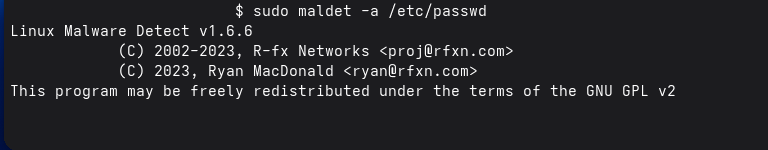
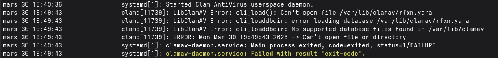

# Troubleshooting ([retour](../SECURITY.md))

Cette section répertorie les différents problèmes que j'ai pu rencontrer avec la configuration de sécurité et leurs solutions.

## ClamAV et LMD :

### 1. Scan qui se lance et reste bloqué après la bannière :

Lorsque vous tentez de lancer un scan avec LMD (configuré pour utiliser les binaires de ClamAV) avec la commande :
```
sudo maldet -a 
```

La bannière apparaît avec les emails des développeurs, puis plus rien :



En exécutant la commande :
```
sudo journalctl -u clamav-daemon.service --no-pager -n 50
```

Vous obtiendrez :


Il s'agit d'une erreur due au fait que le fichier "rfxn.yara" a les permissions :
```
-rw-------
```

Au lieu de :
```
-rw-r--r--
```

Sauf qu'à chaque scan exécuté avec la commande :
```
sudo maldet -a 
```

Les bases de données contenantes les signatures sont à chaque fois copié de "/usr/local/maldetect/sigs" vers "/var/lib/clamav".

### Solution :

On commence par fermer et désactiver les services liés à clamd :
```
sudo maldet --kill-monitor
sudo pkill -9 clamscan
sudo pkill -9 clamd

sudo systemctl stop clamav-daemon.socket
sudo systemctl stop clamav-daemon.service
```

Puis on supprime toutes les signatures de ClamAV, en plus du LocalSocket :
```
sudo rm -f /run/clamav/clamd.ctl
sudo rm -f /var/lib/clamav/*
```

On télécharge de nouveau les bases de données pour ClamAV et LMD :
```
sudo freshclam
sudo maldet -u
```

Puis on vient changer les permissions sur le fichier "rfxn.yara", dans le répertoire source des signatures de LMD, avec la commande :
```
sudo chmod 644 /usr/local/maldetect/sigs/rfxn.yara
```

Puis on redémarre le daemon :
```
sudo systemctl restart clamav-daemon.socket
sudo systemctl restart clamav-daemon.service
```

Maintenant, on vient tester dans cet ordre, avec un répertoire contenant très peu de fichiers :
```
sudo clamscan 
sudo clamdscan 
sudo maldet -a 
```

## ClamAV :

### 1. Permissions non accordées, quel que soit la commande exécutée :

Si jamais en exécutant la commande :
```
sudo journalctl -u clamav-daemon.service --no-pager -n 50
```

Ou
```
pacman -Qkk clamav
```

Et que vous voyez des erreurs liées à un manque de permission, l'installation est complétement corrompue. 

### Solution :

Il faut alors désinstaller ClamAV avec la commande :
```
sudo pacman -Rns clamav
```

Et supprimer tout ce qui concerne ClamAV
```
sudo rm -Rf /etc/clamav
...
```

Et réinstaller complétement ClamAV.

## USBGuard :

### 1. Installation qui ne se fait pas, avec erreur 404 :

Si jamais vous tentez d'installer USBGuard avec la commande :
```
sudo pacman -S usbguard
```

Il se peut que vous ayez une erreur comme quoi les miroirs n'ont pas trouvé les paquets demandés, il faut alors forcer la synchronisation de la base de données avec la commande :
```
sudo pacman -Syyu
```

### 2. Erreur de permission empêchant le démarrage du daemon :

Si jamais le daemon USBGuard ne démarre pas et que dans les logs, vous obtenez une erreur pour le fichier rules.conf, il faut changer les droits de ce dernier :
```
sudo chmod 600 /etc/usbguard/rules.conf
```

Puis redémarer le daemon :
```
sudo systemctl restart usbguard.service
```

## BootCTL :

### 1. Warning : /boot et /boot/loader/random-seed sont accessibles à tout le monde (Security hole)

En regardant le journal de systemd-boot, vous pouvez tomber sur ces deux warnings :


Cela est dû au fait que le répertoire "/boot" et le fichier "random-seed" ont des permissions pour les autres et le groupe propriétaire. Or, seul le propriétaire (qui doit être root), doit avoir les permissions sur ces deux éléments.

Cette erreur est due aux masques (fmask (fichiers) et dmask (répertoire), ou umask (global)) qui sont mal configurés dans le fstab.

### Solution :

Modifier /etc/fstab :
```
UUID=XXXX-XXXX  /boot  vfat  ...,fmask=0177,dmask=0077,...  0  2
```

Puis il suffit de remonter la partition et de redémarrer le daemon et le système :
```
sudo mount -o remount /boot
sudo systemctl daemon-reload
reboot
```

## Firejail :

### 1. Empêche le fonctionnement de Spectacle (KWin) :

Il se peut que lors de l'activation de la configuration de l'utilisation par défaut, le fonctionnement de certains logiciels soit altéré, dont Spectacle (outil de capture d'écran KDE).

Lorsque vous appuyez sur la touche "imp écr", vous obtiendrait l'erreur :
```
Une erreur est survenue durant la réalisation d'une copie d'écran.
Échec de la demande de copie d'écran de KWin :
The process is not authorized to take a screenshot
Informations potentiellement pertinentes : 
- Method: CaptureScreen
- Method specific arguments: "eDP-1"
```

### Solution :

Il faut créer un dossier de backup :
```
mkdir -p ~/.local/share/applications/backup
```

Déplacer l'entrée desktop à l'origine de l'erreur :
```
mv ~/.local/share/applications/org.kde.spectacle.desktop ~/.local/share/applications/backup/
```

Reconstruire le cache KDE :
```
kbuildsycoca6
```

Puis redémarrer.