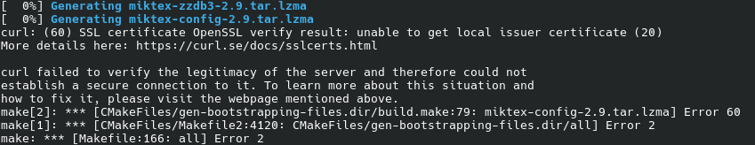

# Miktex-TexWorks ([retour](../SOFTWARE.md))

Il s'agit d'un éditeur et d'un gestionnaire de paquets pour cet éditeur. L'éditeur utilisé est TexWorks, permettant l'écriture complète de documents LaTex.

### Installation des prérequis :
```
sudo pacman -S --needed base-devel cmake git perl curl python fop libxslt apr apr-util bzip2 cairo expat fontconfig freetype2 fribidi gd gmp graphite harfbuzz harfbuzz-icu hunspell icu libjpeg-turbo log4cxx xz libmspack openssl pixman libpng poppler popt potrace uriparser zziplib poppler-qt5 qt5-base boost boost-libs mpfi mpfr docbook-xsl docbook-xml libxslt xmlto
```

### Installation :

Il faut télécharger le source code depuis :

https://miktex.org/download

Puis extraire l'archive et dans le répertoire :
```
mkdir build
cd build
```

Génération des fichiers de build :
```
CFLAGS="-I/usr/include/harfbuzz" CXXFLAGS="-I/usr/include/harfbuzz" cmake .. -DUSE_SYSTEM_HARFBUZZ=ON -DUSE_SYSTEM_HARFBUZZ_ICU=ON
```

Fix de la documentation man :
```
sed -i 's|http://docbook.sourceforge.net/release/xsl/current/manpages/docbook.xsl|/usr/share/xml/docbook/xsl-stylesheets-1.79.2-nons/manpages/docbook.xsl|' /home/<username>/Téléchargements/miktex-26.2/Documentation/Styles/manpages.xsl
```

Lancement du build :
```
make -j1
```

Si, lors du build, vous avez une erreur SSL comme ci-dessous :


Il faut que vous mettiez à jour vos certificats :
```
sudo pacman -Syu ca-certificates ca-certificates-utils ca-certificates-mozilla

sudo update-ca-trust
```

> [!IMPORTANT]
> Il se peut que l'erreur se répète plusieurs fois, vous serez donc amené à exécuter les commandes plusieurs fois.

Si, lors du build, vous avez un échec par rapport à hitex, il faut alors exécuter la commande suivante dans le répertoire ./build/Programs/TeXAndFriends/hitex :
```
LIBDIR="../../../sandbox/miktex/bin/linux-x86_64"

c++ -I/usr/include/harfbuzz -O3 -DNDEBUG \
  CMakeFiles/miktex-hitex.dir/hiput.c.o \
  CMakeFiles/miktex-hitex.dir/hitables.c.o \
  CMakeFiles/miktex-hitex.dir/hitex.c.o \
  CMakeFiles/miktex-hitex.dir/__/__/__/Libraries/MiKTeX/etc/wrapper.cpp.o \
  CMakeFiles/miktex-hitex.dir/miktex/miktex.cpp.o \
  -o "$LIBDIR/miktex-hitex" \
  -Wl,-rpath,"$PWD/$LIBDIR" \
  -Wl,-rpath-link,"$PWD/$LIBDIR" \
  -lharfbuzz-subset -lharfbuzz \
  "$LIBDIR/libmiktex-web2c.so" \
  "$LIBDIR/libmiktex-kpathsea.so" \
  "$LIBDIR/libmiktex-texmf.so" \
  "$LIBDIR/libmiktex-app.so" \
  "$LIBDIR/libmiktex-setup.so" \
  "$LIBDIR/libmiktex-packagemanager.so" \
  "$LIBDIR/libmiktex-archive.so" \
  "$LIBDIR/libmiktex-core.so" \
  "$LIBDIR/libmiktex-md5.so" \
  /usr/lib/libz.so \
  "$LIBDIR/libmiktex-loc.so" \
  "$LIBDIR/libmiktex-util.so" \
  "$LIBDIR/libmiktex-fmt.so" \
  "$LIBDIR/libmiktex-res.so" \
  /usr/lib/libpopt.so
```

Puis il faut relancer le build :
```
make -j1
```

Si, lors du build, vous avez un échec par rapport à luahbtex, il faut alors exécuter la commande suivante dans le répertoire ./build :
```
sed -i 's|/usr/lib/libharfbuzz-icu.so /usr/lib/libharfbuzz.so|/usr/lib/libharfbuzz-icu.so /usr/lib/libharfbuzz-subset.so /usr/lib/libharfbuzz.so|' \
  Programs/TeXAndFriends/luatex/CMakeFiles/miktex-luahbtex.dir/link.txt
```

Puis dans le répertoire ./build/Programs/TeXAndFriends/luatex, il faut exécuter la commande suivante :
```
cmake -E cmake_link_script CMakeFiles/miktex-luahbtex.dir/link.txt --verbose
```

Enfin, il faut relancer le build :
```
make -j1
```

Installation du build :
```
sudo cmake --install .
```

Si, lors de l'installation, vous avez une erreur sur miktex-hitex, il faut exécuter la commande suivante dans le répertoire ./Programs/TeXAndFriends/hitex :
```
/usr/bin/c++ -I/usr/include/harfbuzz -O3 -DNDEBUG \
  CMakeFiles/miktex-hitex.dir/hiput.c.o \
  CMakeFiles/miktex-hitex.dir/hitables.c.o \
  CMakeFiles/miktex-hitex.dir/hitex.c.o \
  CMakeFiles/miktex-hitex.dir/__/__/__/Libraries/MiKTeX/etc/wrapper.cpp.o \
  CMakeFiles/miktex-hitex.dir/miktex/miktex.cpp.o \
  -o ../../../sandbox/miktex/bin/linux-x86_64/miktex-hitex \
  -Wl,-rpath,/home/<username>/Téléchargements/miktex-26.2/build/sandbox/miktex/bin/linux-x86_64: \
  -lharfbuzz-subset -lharfbuzz \
  ../../../sandbox/miktex/bin/linux-x86_64/libmiktex-web2c.so \
  ../../../sandbox/miktex/bin/linux-x86_64/libmiktex-kpathsea.so \
  ../../../sandbox/miktex/bin/linux-x86_64/libmiktex-texmf.so \
  ../../../sandbox/miktex/bin/linux-x86_64/libmiktex-app.so \
  ../../../sandbox/miktex/bin/linux-x86_64/libmiktex-setup.so \
  ../../../sandbox/miktex/bin/linux-x86_64/libmiktex-packagemanager.so \
  ../../../sandbox/miktex/bin/linux-x86_64/libmiktex-archive.so \
  ../../../sandbox/miktex/bin/linux-x86_64/libmiktex-core.so \
  ../../../sandbox/miktex/bin/linux-x86_64/libmiktex-md5.so \
  ../../../sandbox/miktex/bin/linux-x86_64/libmiktex-trace.so \
  /usr/lib/libz.so \
  ../../../sandbox/miktex/bin/linux-x86_64/libmiktex-loc.so \
  ../../../sandbox/miktex/bin/linux-x86_64/libmiktex-util.so \
  ../../../sandbox/miktex/bin/linux-x86_64/libmiktex-fmt.so \
  ../../../sandbox/miktex/bin/linux-x86_64/libmiktex-res.so \
  /usr/lib/libpopt.so \
  -Wl,-rpath-link,/home/<username>/Téléchargements/miktex-26.2/build/sandbox/miktex/bin/linux-x86_64
```

Puis relancer l'installation :
```
sudo cmake --install .
```

### Terminer la configuration :
```
Lancer MiKTeX Console > Finish Private Setup > Onglet Updates > Check for updates > Update now
```