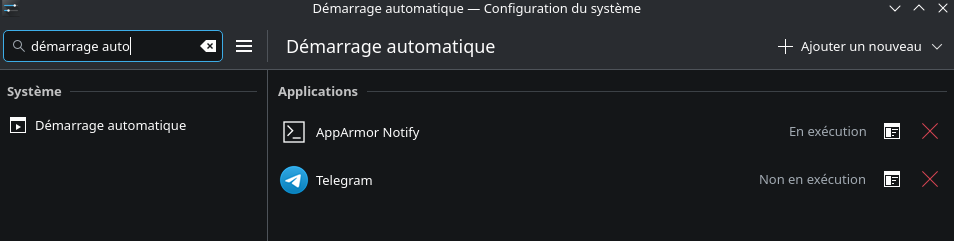

# Telegram Desktop ([retour](../SOFTWARE.md))

Telegram, un service de messagerie instantané, est accessibles avec une interface graphique via sa version Desktop, directement depuis les paquets pacman.

### Installation :

```
pacman -S telegram-desktop
```

### Configuration de l'exécution au démarrage :

Il suffit tout simplement d'ajouter le .desktop de Telegram dans la configuration système "Démarrage automatique" (autostart) :

